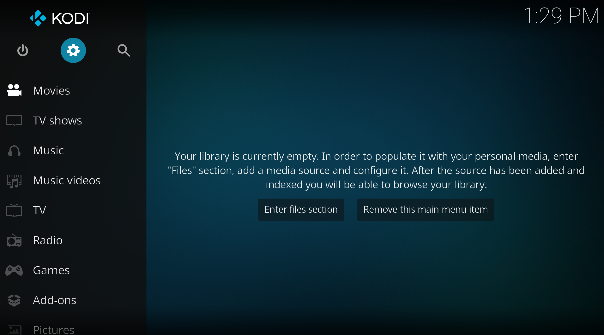
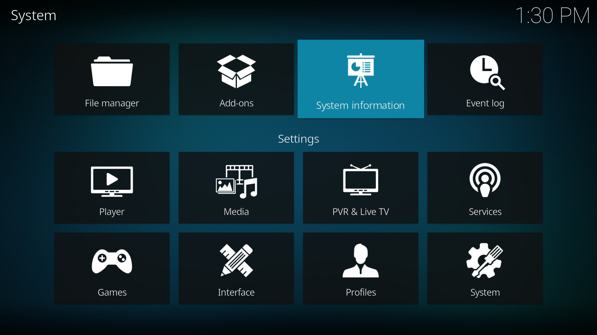
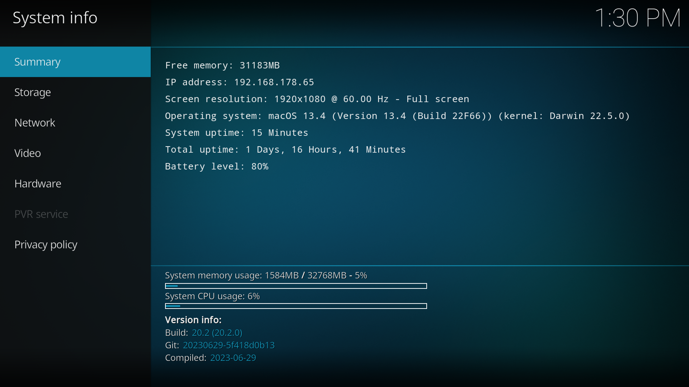
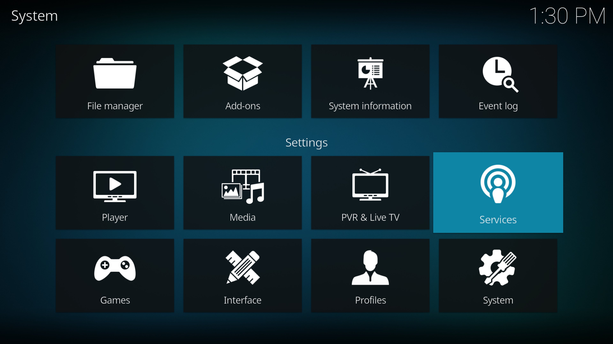
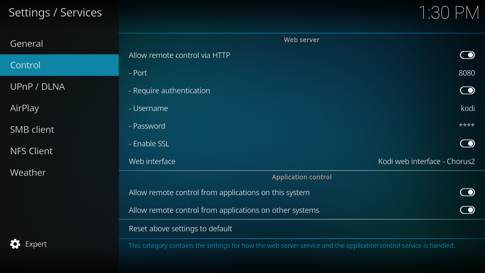

# Devices

To add a Kodi device, you need to first enable access in the settings of your Kodi application.

**Step 1:** Access the settings.

**Step 2:** Go to the "System Information" section and note down the IP address of your device.

**Step 3:** Go to the "Services > Controls" section 

- Enable "Allow remote control over HTTP."
- Make a note of the port.
- Enable "Requires authentication."
- Select a username and password.
- Enable "Allow remote control from applications on other systems."

Keep this information handy.

**Step 4:** Open your Streamshare application and go to the "Settings" tab, then access the "Devices" section.

Click the "+" button and provide the requested information.

- Name
- URL
- Port
- Username
- Password

Save.

If the device is configured correctly, you should see your device in the Remote Control tab in green.

**What to do if my device is not accessible?**

**Step 1:** Ensure that your Streamshare application and your Kodi device are connected to the same network.

**Step 2:** Check the connection settings by revisiting the previous procedure.
